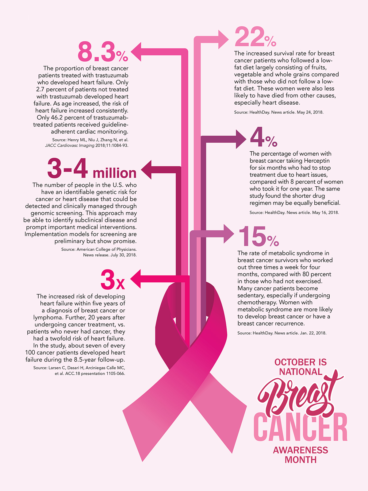

# Breast Cancer Classification

<b>Predicting if the breast cancer diagnosis is benign or malignant based on several observations</b>

 

Pipeline of this case study with some QnA:

<b>STEP #1:</b>
- Problem Statment

<b>STEP #2:</b>
- IMPORT and UNDERSTAND DATA 

<b>STEP #3:</b>
- VISUALIZING THE DATA

<b>STEP #4:</b>
- MODEL TRAINING (FINDING A PROBLEM SOLUTION)

<b>STEP #5:</b>
- EVALUATING THE MODEL

<b>STEP #6:</b>
- IMPROVING THE MODEL - PART 1
- IMPROVING THE MODEL - PART 2

End of this CASE STUDY after evaluating Classification Report of Improvised Model as <b>97% Accuracy</b>.

Reference: https://archive.ics.uci.edu/ml/datasets/Breast+Cancer+Wisconsin+(Diagnostic)

 
